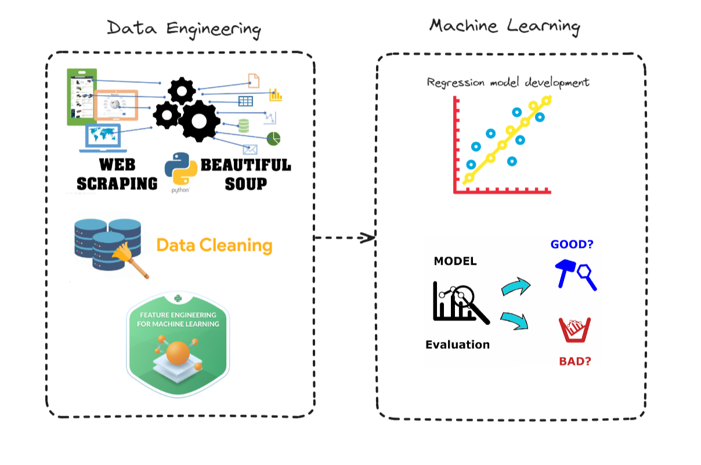
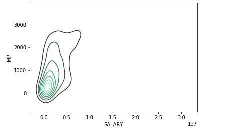
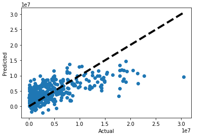

<h1 align="center">

</h1> 

# Vulnerability Analysis

  

This project explores the versatility of NBA players through comprehensive data analysis combining web scraping, advanced data manipulation, and machine learning techniques. Utilizing data from the 2013-2014 NBA season, the analysis focuses on player salaries and performance metrics to identify patterns and determine what factors contribute to a player's versatility and effectiveness on the court.
  

<h1 align="center">

</h1> 

## 🏗️ System Architecture
<h1 align="center">

</h1> 

## 🔑 Key Feature

### Web Scraping:
Automated data collection from websites like Basketball Reference and ESPN to gather comprehensive player statistics and salary information.
  

### Data Merging and Cleaning:
Integration of multiple datasets to create a robust dataset that includes player statistics alongside salary data. Techniques include handling duplicates, merging data frames, and converting data types for analysis.
  

### Statistical Analysis and Visualization:

Application of descriptive statistics, correlation analysis, and advanced visualizations (e.g., Kernel Density Plots) to uncover relationships between player performance metrics and salaries.

### Predictive Modeling:
Development of regression models to predict player salaries based on performance metrics, employing techniques like Linear Regression and Ridge Regression to evaluate the impact of various player statistics.
  

## 🖥️ Final Output:
- Key Predictors Identified: Determined which player statistics are most strongly correlated with salaries.
- Insights into Player Versatility: Provided insights into players' versatility and their value on the court.
- Data-Driven Decision Making: Enabled NBA teams to make informed decisions based on player performance data.
- Salary Prediction Models: Developed regression models to predict player salaries effectively.
- Enhanced Recruitment and Development: Offered data to help refine recruitment and player development strategies.
- Skills Demonstration: Showcased advanced statistical and machine learning skills applicable in various contexts.

## 🧠 Skills
- Python (Pandas, NumPy, Seaborn, Matplotlib, Scikit-learn)
- Web Scraping (BeautifulSoup, requests, lxml)
- Data Visualization
- Statistical Modeling
- Machine Learning

## 🦾Future Work
- Model Enhancement: Explore more complex models such as Random Forest and Gradient Boosting Machines for better predictive performance.
- Expand Data Sources: Incorporate additional data points such as advanced metrics (e.g., Player Efficiency Rating, Win Shares) and off-court factors (e.g., marketability, social media presence) to enhance model accuracy.
